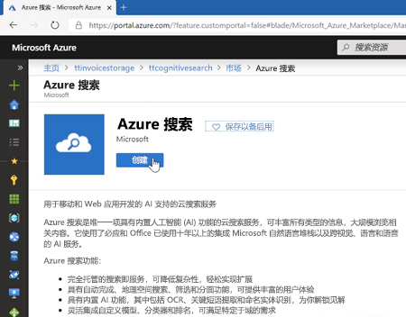
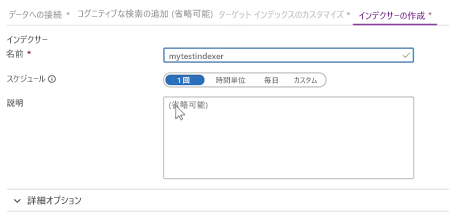
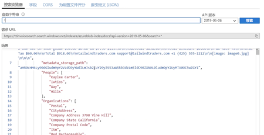

# <a name="demo-1---azure-cognitive-search"></a>Demonstração 1 – Azure Cognitive Search

[](https://globaleventcdn.blob.core.windows.net/assets/aiml/aiml10/videos/Demo1.mp4 "Demonstração 1")

## <a name="summary"></a>Resumo
Neste exercício, demonstramos as funções básicas do Azure Cognitive Search com o conjunto interno de habilidades inteligentes. Há várias maneiras de criar os recursos necessários para esta demonstração:
1. Acompanhe o vídeo acima (cada etapa é apresentada) ou
2. Use a [CLI do Azure](https://docs.microsoft.com/en-us/cli/azure/install-azure-cli?view=azure-cli-latest&WT.mc_id=msignitethetour2019-github-aiml10)


## <a name="what-you-need"></a>Do que você precisa
- [Conjunto de teste de faturas](https://globaleventcdn.blob.core.windows.net/assets/aiml/aiml10/data/test.zip)

## <a name="azure-resources"></a>Recursos do Azure
Estes são os recursos que criamos na primeira demonstração. Embora esta tabela descreva os nomes dos recursos, como mostrado no vídeo, altere os nomes de cada um dos recursos à vontade.


| Nome                       | Tipo                            | Finalidade                    |
| -------------------------- | ------------------------------- | ------------------------- |
| **ttcognitivesearch**     | Grupo de Recursos                  | Agrupa os serviços   |
| **ttinvoicestorage**      | Conta de armazenamento                 | Usada para armazenar faturas     |
| **ttinvoicesearch**       | Serviço de pesquisa                  | Serviço apresentado           |
| **ttinvoiceintelligence** | Serviços Cognitivos (Tudo-em-um) | Usados no serviço de pesquisa |


## <a name="what-to-do"></a>O que fazer

Existem três etapas principais:
1. Criar um grupo de recursos
2. Criar e usar uma conta de armazenamento
3. Criar e usar um recurso de Serviço de Pesquisa


### <a name="create-a-resource-group"></a>Criar um grupo de recursos
Todos os nossos recursos residirão nesse grupo.

```
az group create --location {LOCATION} --name {YOUR_RG_NAME}
```

### <a name="create-and-use-storage-account"></a>Criar e usar uma conta de armazenamento
A conta de armazenamento é usada principalmente para armazenar faturas.

1. Criar conta de armazenamento

```
az storage account create --name {YOUR_STORAGE_NAME} --location {LOCATION} --resource-group {YOUR_RG_NAME} --sku Standard_LRS
```

2. Criar o contêiner `test`

[](https://docs.microsoft.com/en-us/azure/storage/blobs/storage-quickstart-blobs-portal?WT.mc_id=msignitethetour2019-github-aiml10 "Criar contêiner")

3. Baixe e descompacte o [conjunto de teste de faturas](https://globaleventcdn.blob.core.windows.net/assets/aiml/aiml10/data/test.zip).

4. Carregue o [conjunto de dados de faturas](https://globaleventcdn.blob.core.windows.net/assets/aiml/aiml10/data/test.zip) descompactado no contêiner `test`. Isso pode ser feito diretamente usando o [portal](https://docs.microsoft.com/en-us/azure/storage/blobs/storage-quickstart-blobs-portal?WT.mc_id=msignitethetour2019-github-aiml10#upload-a-block-blob) ou o aplicativo [Gerenciador de Armazenamento do Azure](https://docs.microsoft.com/en-us/azure/vs-azure-tools-storage-explorer-blobs?WT.mc_id=msignitethetour2019-github-aiml10) (como demonstrado neste [vídeo](https://globaleventcdn.blob.core.windows.net/assets/aiml/aiml10/videos/Demo1.mp4 "Demonstração 1")).

### <a name="create-and-use-a-search-service-resource"></a>Criar e usar um recurso de Serviço de Pesquisa
Crie um serviço de pesquisa:

[](https://docs.microsoft.com/en-us/azure/search/search-create-service-portal?WT.mc_id=msignitethetour2019-github-aiml10 "Azure Search")


Use o serviço de pesquisa:

1. no serviço recém-criado, clique em `Import Data`

[](https://docs.microsoft.com/en-us/azure/search/cognitive-search-quickstart-blob?WT.mc_id=msignitethetour2019-github-aiml10#create-the-enrichment-pipeline "Importar dados")

2. Use uma conexão existente para o contêiner `test` que criamos em nossa conta de armazenamento.

[](https://docs.microsoft.com/en-us/azure/search/cognitive-search-quickstart-blob?WT.mc_id=msignitethetour2019-github-aiml10#step-1-create-a-data-source "Importar dados")

3. Crie um novo recurso de Serviços Cognitivos

[](https://docs.microsoft.com/en-us/azure/search/cognitive-search-quickstart-blob?WT.mc_id=msignitethetour2019-github-aiml10#step-2-add-cognitive-skills "Criar Serviços Cognitivos")

4. Volte para o assistente e clique em atualizar. Você deverá ver o serviço recém-criado. 

5. Agora é possível adicionar todos os aprimoramentos que você quiser!

[](https://docs.microsoft.com/en-us/azure/search/cognitive-search-quickstart-blob?WT.mc_id=msignitethetour2019-github-aiml10#step-2-add-cognitive-skills "Adicionar aprimoramentos")

6. Depois de clicar em `Customize Target Index`, examine o índice proposto e clique em `Create and Indexer`.

[](https://docs.microsoft.com/en-us/azure/search/cognitive-search-quickstart-blob?WT.mc_id=msignitethetour2019-github-aiml10#step-3-configure-the-index "Primeiro índice")

7. Dê um nome ao novo indexador e clique em `Submit`

[](https://docs.microsoft.com/en-us/azure/search/cognitive-search-quickstart-blob?WT.mc_id=msignitethetour2019-github-aiml10#step-4-configure-the-indexer "Primeiro indexador")

8. Quando a indexação terminar, fique à vontade para experimentar algumas consultas:

[](https://docs.microsoft.com/en-us/azure/search/cognitive-search-quickstart-blob?WT.mc_id=msignitethetour2019-github-aiml10#query-in-search-explorer "Primeira pesquisa")

# <a name="next-demo"></a>Próxima demonstração
Saiba como usar o serviço cognitivo do Reconhecimento de Formulários na [Demonstração 2 – Uso do Reconhecimento de Formulários](demo2.md)