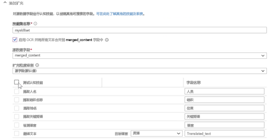
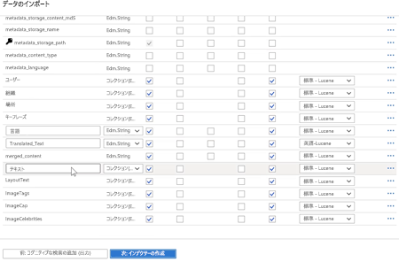

# <a name="demo-1---azure-cognitive-search"></a>デモ 1 - Azure Cognitive Search

[](https://globaleventcdn.blob.core.windows.net/assets/aiml/aiml10/videos/Demo1.mp4 "デモ 1")

## <a name="summary"></a>概要
この演習では、Azure Cognitive Search と組み込みのインテリジェント スキルセットの組み合わせによる基本的な機能について見ていただきます。 このデモに必要なリソースを作成するには、いくつかの方法があります。
1. 上のビデオに従います (各ステップについて説明されています)
2. [Azure CLI](https://docs.microsoft.com/en-us/cli/azure/install-azure-cli?view=azure-cli-latest&WT.mc_id=msignitethetour2019-github-aiml10) を使用します


## <a name="what-you-need"></a>必要なもの
- [請求書テスト セット](https://globaleventcdn.blob.core.windows.net/assets/aiml/aiml10/data/test.zip)

## <a name="azure-resources"></a>Azure リソース
これらは、最初のデモで作成するリソースです。 この表では、ビデオで示されているリソースの名前が使われていますが、リソースごとに独自の名前を使用してください。


| 名前                       | 種類                            | 目的                    |
| -------------------------- | ------------------------------- | ------------------------- |
| **ttcognitivesearch**     | リソース グループ                  | サービスをグループにまとめます   |
| **ttinvoicestorage**      | ストレージ アカウント                 | 請求書の格納に使用します     |
| **ttinvoicesearch**       | 検索サービス                  | おすすめのサービスです           |
| **ttinvoiceintelligence** | Cognitive Services (オールインワン) | 検索サービスで使用されます |


## <a name="what-to-do"></a>手順

主な手順が 3 つあります。
1. リソース グループを作成する
2. ストレージ アカウントを作成して使用する
3. 検索サービス リソースを作成して使用する


### <a name="create-a-resource-group"></a>リソース グループを作成する
すべてのリソースがこのグループに存在します。

```
az group create --location {LOCATION} --name {YOUR_RG_NAME}
```

### <a name="create-and-use-storage-account"></a>ストレージ アカウントを作成して使用する
ストレージ アカウントは、主に請求書の格納に使用されます。

1. ストレージ アカウントを作成します

```
az storage account create --name {YOUR_STORAGE_NAME} --location {LOCATION} --resource-group {YOUR_RG_NAME} --sku Standard_LRS
```

2. `test` という名前のコンテナーを作成します

[](https://docs.microsoft.com/en-us/azure/storage/blobs/storage-quickstart-blobs-portal?WT.mc_id=msignitethetour2019-github-aiml10 "コンテナーを作成する")

3. [請求書テスト セット](https://globaleventcdn.blob.core.windows.net/assets/aiml/aiml10/data/test.zip)をダウンロードして解凍します。

4. 解凍された[請求書テスト セット](https://globaleventcdn.blob.core.windows.net/assets/aiml/aiml10/data/test.zip)を `test` コンテナーにアップロードします。 これは、[ポータル](https://docs.microsoft.com/en-us/azure/storage/blobs/storage-quickstart-blobs-portal?WT.mc_id=msignitethetour2019-github-aiml10#upload-a-block-blob)を使用して直接、または [Azure Storage Explorer](https://docs.microsoft.com/en-us/azure/vs-azure-tools-storage-explorer-blobs?WT.mc_id=msignitethetour2019-github-aiml10) アプリケーションを使用して ([ビデオ](https://globaleventcdn.blob.core.windows.net/assets/aiml/aiml10/videos/Demo1.mp4 "デモ 1")を参照)、行うことができます。

### <a name="create-and-use-a-search-service-resource"></a>検索サービス リソースを作成して使用する
検索サービスを作成します。

[](https://docs.microsoft.com/en-us/azure/search/search-create-service-portal?WT.mc_id=msignitethetour2019-github-aiml10 "Azure Search")


検索サービスを使用します。

1. 新しく作成したサービスで、[`Import Data`] をクリックします

[](https://docs.microsoft.com/en-us/azure/search/cognitive-search-quickstart-blob?WT.mc_id=msignitethetour2019-github-aiml10#create-the-enrichment-pipeline "データをインポートする")

2. ストレージ アカウントで作成した `test` コンテナーへの既存の接続を使用します。

[](https://docs.microsoft.com/en-us/azure/search/cognitive-search-quickstart-blob?WT.mc_id=msignitethetour2019-github-aiml10#step-1-create-a-data-source "データをインポートする")

3. 新しい Cognitive Services リソースを作成します

[](https://docs.microsoft.com/en-us/azure/search/cognitive-search-quickstart-blob?WT.mc_id=msignitethetour2019-github-aiml10#step-2-add-cognitive-skills "Cognitive Services を作成する")

4. ウィザードに戻り、[最新の情報に更新] をクリックします。 新しく作成したサービスが表示されます。 

5. 好みの機能強化を追加できるようになります。

[](https://docs.microsoft.com/en-us/azure/search/cognitive-search-quickstart-blob?WT.mc_id=msignitethetour2019-github-aiml10#step-2-add-cognitive-skills "機能強化を追加する")

6. [`Customize Target Index`] をクリックした後、提案されたインデックスを確認し、[`Create and Indexer`] をクリックします。

[](https://docs.microsoft.com/en-us/azure/search/cognitive-search-quickstart-blob?WT.mc_id=msignitethetour2019-github-aiml10#step-3-configure-the-index "最初のインデックス")

7. 新しいインデクサーの名前を指定して、[`Submit`] をクリックします

[](https://docs.microsoft.com/en-us/azure/search/cognitive-search-quickstart-blob?WT.mc_id=msignitethetour2019-github-aiml10#step-4-configure-the-indexer "最初のインデクサー")

8. インデックス付けが完了したら、自由にクエリをいくつか試してみます。

[](https://docs.microsoft.com/en-us/azure/search/cognitive-search-quickstart-blob?WT.mc_id=msignitethetour2019-github-aiml10#query-in-search-explorer "最初の検索")

# <a name="next-demo"></a>次のデモ
「[デモ 2 - Form Recognizer を使用する](demo2.md)」に進み、Form Recognizer Cognitive サービスを使用する方法について学習します