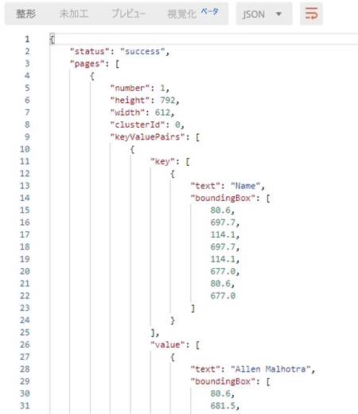

## <a name="demo-2---using-form-recognizer"></a>演示 2 - 使用表单识别器

[](https://globaleventcdn.blob.core.windows.net/assets/aiml/aiml10/videos/Demo2.mp4 "演示 2")

## <a name="summary"></a>摘要
在此练习中，我们了解如何使用表单识别器服务。 假定已创建存储帐户（如[第一个演示](demo1.md)中所述）。


## <a name="what-you-need"></a>需要什么
- [发票训练集](https://globaleventcdn.blob.core.windows.net/assets/aiml/aiml10/data/train.zip)

- 对访问受限的预览版的访问权限。 若要访问预览版，请填写并提交[表单识别器访问请求](https://aka.ms/FormRecognizerRequestAccess)表单。

- [Postman](https://www.getpostman.com/) 用于将请求发送到表单识别器服务 REST API。 请参阅此[简要入门](postman.md)以了解详细信息。

- Postman 表单识别器会请求[集合](src/Collections/Form_Recognizer.postman_collection.json)。

## <a name="azure-resources"></a>Azure 资源
在此演示中，我们使用的唯一资源是表单识别器服务。


| 名称                       | 类型                            | 用途                    |
| -------------------------- | ------------------------------- | ------------------------- |
| **ttinvoicereader**       | 表单识别器服务         | 此服务最终会出现在全合一服务中。 目前，它在访问受限的预览版中。 若要访问预览版，请填写并提交[表单识别器访问请求](https://aka.ms/FormRecognizerRequestAccess)表单。  |


## <a name="what-to-do"></a>要执行的操作

有三个主要步骤：
1. 将训练数据上传到存储帐户
2. 创建表单识别器服务
3. 训练并使用表单识别器服务

### <a name="upload-training-data"></a>上传训练数据


1. 在存储帐户（已在前面的演示中创建）中创建名为 `train` 的容器。

[](https://docs.microsoft.com/en-us/azure/storage/blobs/storage-quickstart-blobs-portal?WT.mc_id=msignitethetour2019-github-aiml10 "创建容器")

2. 下载并解压缩[发票训练集](https://globaleventcdn.blob.core.windows.net/assets/aiml/aiml10/data/train.zip)。

3. 将解压缩的[发票训练集](https://globaleventcdn.blob.core.windows.net/assets/aiml/aiml10/data/train.zip)上传到 `train` 容器。 可以直接通过[门户](https://docs.microsoft.com/en-us/azure/storage/blobs/storage-quickstart-blobs-portal?WT.mc_id=msignitethetour2019-github-aiml10#upload-a-block-blob)这样做，也可以通过 [Azure 存储资源管理器](https://docs.microsoft.com/en-us/azure/vs-azure-tools-storage-explorer-blobs?WT.mc_id=msignitethetour2019-github-aiml10)这样做（详见[视频](https://globaleventcdn.blob.core.windows.net/assets/aiml/aiml10/videos/Demo2.mp4 "演示 1")）。

### <a name="create-form-recognizer-service"></a>创建表单识别器服务

为此，必须有权访问表单识别器预览版。 若要访问预览版，请填写并提交[表单识别器访问请求](https://aka.ms/FormRecognizerRequestAccess)表单。 


[](https://docs.microsoft.com/en-us/azure/cognitive-services/form-recognizer/overview?WT.mc_id=msignitethetour2019-github-aiml10#request-access "表单识别器")

### <a name="train-the-form-recognizer-service"></a>训练表单识别器服务

此部分使用 Postman 并假定你了解如何加载集合、处理变量和设置预请求脚本。 若要了解如何执行这些特定的操作，请查看我们提供的一些[说明](postman.md)。

下表列出了在此部分练习中设置的变量：

| 名称                       | 类型                            | 用途                    |
| -------------------------- | ------------------------------- | ------------------------- |
| `Ocp-Apim-Subscription-Key`       | 授权         | 用于获取表单识别器服务访问权限的密钥  |
| `endpoint`       | 变量         | 指定表单识别器终结点  |
| `modelId`       | 变量         | 当前的表单识别器模型（在步骤 5 中设置）  |

1. 将[表单识别器集合](src/Collections/Form_Recognizer.postman_collection.json)加载到 Postman 中。

2. 将 `Ocp-Apim-Subscription-Key` 授权标头和 `endpoint` 变量设置为表单识别器服务（这些都可以在门户中找到）。

3. 打开 `TrainModel` 请求并更改预请求脚本，将 `storageAccount` 变量设置为你的存储帐户（在视频中，此变量为 `ttinvoicestorage`），并将 `SASValue` 设置为 `train` 容器的相应安全访问签名。 若要了解如何获取安全访问签名，请参阅我们的[简要说明](sas.md)。

```javascript
pm.environment.set('storageAccount', '<YOUR STORAGE ACCOUNT>')
pm.environment.set('container', 'train')
pm.environment.set('SASValue', '<SAS>')
```

4. 按请求上的“发送”。 响应应如下所示：


5. 将集合的 `modelId` 变量设置为返回的 `modelId`，如上所示。


### <a name="use-the-form-recognizer-service"></a>使用表单识别器服务

1. 打开 `AnalyzeForm` 请求。 在“正文”  部分单击`Select Files`按钮，选择以前下载的发票。 发送请求后，应该会获得类似于以下内容的响应：



# <a name="next-demo"></a>下一演示
请转到[演示 3 - 创建自定义发票读取者技能](demo3.md)，了解如何使用 Azure Functions 创建自定义发票读取者技能