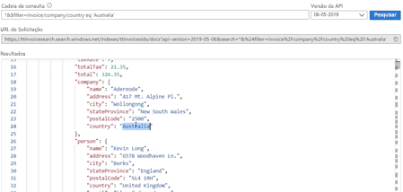

## <a name="demo-4---tying-it-all-together"></a>デモ 4 - すべてをまとめて結び付ける

[](https://globaleventcdn.blob.core.windows.net/assets/aiml/aiml10/videos/Demo4.mp4 "デモ 4")

## <a name="summary"></a>概要
この演習では、すべてのリソースをまとめて、Azure Cognitive Search 内にインデックス、スキルセット、データソース、およびインデクサーを作成し、PDF ファイルのコレクションから請求書データを抽出します。 前の演習のすべてのリソースとサービスが作成され、適切に設定されていることを前提としています。


## <a name="what-you-need"></a>必要なもの
- [請求書データ セット](https://globaleventcdn.blob.core.windows.net/assets/aiml/aiml10/data/invoices_1000.zip) (これは、サービスを実行して機能をテストするための 1000 権の請求書の小さなセットです)


- Form Recognizer サービス REST API に要求を送信するには、[Postman](https://www.getpostman.com/) を使用します。 詳細については、この[簡単な概要](postman.md)を参照してください。

- Postman の[請求書検索要求コレクション](src/Collections/Invoice_Search.postman_collection.json)。

## <a name="what-to-do"></a>手順

主な手順が 3 つあります。
1. 請求書をストレージ アカウントにアップロードする
2. Azure Search のインデックス、スキルセット、データソース、およびインデクサーを準備する
3. インデックスを監視して使用する

### <a name="upload-invoice-data"></a>請求書データをアップロードする


1. 最初のデモで作成したストレージ アカウントに、`invoices` という名前のコンテナーを作成します。

[](https://docs.microsoft.com/en-us/azure/storage/blobs/storage-quickstart-blobs-portal?WT.mc_id=msignitethetour2019-github-aiml10 "コンテナーを作成する")

2. [請求書データ セット](https://globaleventcdn.blob.core.windows.net/assets/aiml/aiml10/data/invoices_1000.zip)をダウンロードして解凍します。

3. 解凍された[請求書データ セット](https://globaleventcdn.blob.core.windows.net/assets/aiml/aiml10/data/invoices_1000.zip)を `invoices` コンテナーにアップロードします。 これは、[ポータル](https://docs.microsoft.com/en-us/azure/storage/blobs/storage-quickstart-blobs-portal?WT.mc_id=msignitethetour2019-github-aiml10#upload-a-block-blob)を使用して直接、または [Azure Storage Explorer](https://docs.microsoft.com/en-us/azure/vs-azure-tools-storage-explorer-blobs?WT.mc_id=msignitethetour2019-github-aiml10) を使用して、行うことができます。

### <a name="prepare-azure-search"></a>Azure Search を準備する

このセクションでは、Postman を使用します。コレクションの読み込み、変数の処理、および事前要求スクリプトの設定について理解していることを前提としています。 これらの特定の操作を行う方法については、いくつかの[説明](postman.md)を用意してあります。

| 名前                       | 種類                            | 目的                    |
| -------------------------- | ------------------------------- | ------------------------- |
| `api-key`       | 認可         | Azure Search アクセスのキー  |
| `search_service`       | 変数         | 検索サービスの URL (プロトコルまたはスラッシュなし)  |
| `index_name`       | 変数         | 目的のインデックスの名前  |
| `storageConnectionString`       | 変数         | 請求書が含まれるストレージ アカウントへの接続文字列  |
| `cog_svcs_key`       | 変数         | [デモ 1](demo1.md) で使用したオールインワン Cognitive Services に対するキー  |

1. [請求書検索要求コレクション](src/Collections/Invoice_Search.postman_collection.json)を Postman に読み込みます。

2. 上の表で説明されているように、すべての変数を設定します。 これらの各値 (`index_name`を除く) は、ポータルの各サービスで確認できます。 `index_name` には好きな値を選択できます。

3. `Create Index` 要求を開いて実行します ([送信] ボタンを使用)。 これにより、請求書データが格納されるインデックスが作成されます。 要求が正常に完了した後、ポータルの Azure Search サービスに変更が反映されます。


4. `Create Skillset` 要求を開いて実行します ([送信] ボタンを使用)。 これにより、インデクサーが請求書データを抽出するために使用するカスタム スキルセットが作成されます。 この特定のスキルセットには、スキルが 1 つしかありません (カスタム `InvoiceReaderSkill`)。 前と同じように、要求が正常に完了すると、新しいスキルセットがポータルに反映されて表示されます。

5. `Create Datasource` 要求を開いて実行します ([送信] ボタンを使用)。 これにより、請求書が配置されるストレージ アカウントへの参照が作成されます。 前と同じように、要求が正常に完了すると、新しいスキルセットがポータルに反映されて表示されます。

6. `Create Indexer` 要求を開いて実行します ([送信] ボタンを使用)。 これにより、`Datasource` から請求書を取得し、各請求書の `Skillset` を使用して、実際の `Index` にデータを格納するインデクサーが作成されます。 前と同じように、要求が正常に完了すると、新しいスキルセットがポータルに反映されて表示されます。


### <a name="monitor-and-use-index"></a>インデックスを監視して使用する
インデクサーによってすべての請求書ドキュメントが処理されるまで、少し時間がかかります。 これは Search Service 自体で監視できます。 また、Azure 関数にアタッチされている対応する App Insights サービスの Live Metrics Stream を調べることによって、`InvoiceReaderSkill` の呼び出しを監視することもできます。 インデックスにいくつかのドキュメントが存在するようになったら、クエリを実行して動作していることを確認できます。



**実行してみると面白いクエリ**:

ItemId 49 の注文
```
*&$filter=invoice/lineItems/any(lineItems: lineItems/itemId eq 49)
```

invoiceId が 12179
```
*&$filter=invoice/invoiceId eq 12179
```

オーストラリアの企業
```
*&$filter=invoice/company/country eq 'Australia'
```

英国の企業 (カウントあり)
```
*&$count=true&$filter=invoice/company/country eq 'United Kingdom'
```

請求書のみを取得する
```
*&$select=invoice&$count=true
```

ドイツの人
```
*&$count=true&$select=invoice/person&$filter=invoice/person/country eq 'Germany'
```

# <a name="next-demo"></a>次のデモ
「[デモ 5 - ナレッジストア](demo5.md)」に進んで、ナレッジ ストアを調べる方法について学習します