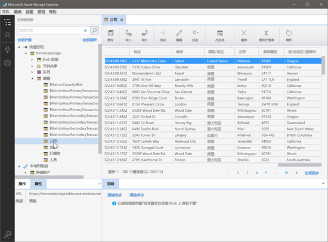

## <a name="demo-5"></a>デモ 5

[](https://globaleventcdn.blob.core.windows.net/assets/aiml/aiml10/videos/Demo5.mp4 "デモ 5")

## <a name="summary"></a>概要
この演習では、[前の演習](demo4.md)で作成したスキルセットによってナレッジ ストアにプッシュされたデータを調べます。 このプロジェクションは、前に実行された `Create Skillset` PUT 要求の `Skillset` 定義の一部でした。 サービスに送信される部分は次のとおりです。

```json
"knowledgeStore": { 
  "storageConnectionString": "{{storageConnectionString}}", 
    "projections": [{ 
      "tables": [  
        { "tableName": "Invoices", "generatedKeyName": "InvoiceRef", "source": "/document/invoice" , "sourceContext": null, "inputs": []}, 
        { "tableName": "Company", "generatedKeyName": "CompanyRef", "source": "/document/invoice/company", "sourceContext": null, "inputs": []}, 
        { "tableName": "People", "generatedKeyName": "PersonRef", "source": "/document/invoice/person", "sourceContext": null, "inputs": []}, 
        { "tableName": "LineItems", "generatedKeyName": "LinteItemRef", "source": "/document/invoice/lineItems/*" ,"sourceContext": null, "inputs": []} 
      ]  
    }]
}
```
これでは、プロジェクションのターゲットとして `storageConnectionString` が使用されていました。 この場合、データを保存するために、ストレージ サービスの一部である Azure Storage テーブルを使用します。

## <a name="what-to-do"></a>手順
残っているのは、インデクサーがスキルセットを使用してデータをナレッジ ストアに投影した方法を調べることです。 これは、Microsoft [Azure Storage Explorer](https://docs.microsoft.com/en-us/azure/vs-azure-tools-storage-explorer-blobs?WT.mc_id=msignitethetour2019-github-aiml10) を使って行うことができます。


