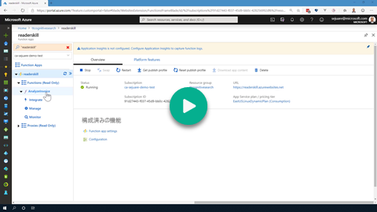
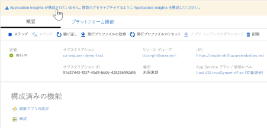

## <a name="demo-3---creating-a-custom-invoice-reader-skill"></a>デモ 3 - カスタム請求書リーダー スキルを作成する

[](https://globaleventcdn.blob.core.windows.net/assets/aiml/aiml10/videos/Demo2.mp4 "デモ 3")

## <a name="summary"></a>概要
この演習では、Azure Search からデータを取得し、pdf の請求書の内容を表す構造化された json ドキュメントを返す、Azure Search スキルを (Azure 関数の形式で) 作成します。 Azure 関数の作成方法に関するさらに詳しい情報については、こちらの[ドキュメント](https://docs.microsoft.com/en-us/azure/azure-functions/functions-create-first-azure-function-azure-cli?WT.mc_id=msignitethetour2019-github-aiml10)を参照してください。ストレージ アカウントが作成されていることを前提としています ([最初のデモ](demo1.md)で説明されているように、[2 番目のデモ](demo2.md)で作成された Form Recognizer サービスと同様に)


## <a name="what-you-need"></a>必要なもの
- [請求書テスト セット](https://globaleventcdn.blob.core.windows.net/assets/aiml/aiml10/data/train.zip) (Azure 関数のテストに使用)


- Form Recognizer サービス REST API に要求を送信するには、[Postman](https://www.getpostman.com/) を使用します。 詳細については、この[簡単な概要](postman.md)を参照してください。

- Postman リーダー スキル要求の[コレクション](src/Collections/Reader_Skill.postman_collection.json)。

- [Azure Functions Core Tools](https://docs.microsoft.com/en-us/azure/azure-functions/functions-run-local?WT.mc_id=msignitethetour2019-github-aiml10#v2)

## <a name="azure-resources"></a>Azure リソース
次の表では、この演習全体で作成されるリソースについて説明します。

| 名前                       | 種類                            | 目的                    |
| -------------------------- | ------------------------------- | ------------------------- |
| **readerskillstorage**   | ストレージ アカウント              | Azure 関数に使用されるストレージ |
| **readerskill**          | Function App                 | コグニティブ スキル アプリ |
| **readerskill**          | App Insights                   | 関数アプリに分析情報を追加します |
| **EastUS2LinuxDynamicPlan** | App Service プラン                   | 関数アプリを実行するための従量課金制プラン (これは暗黙的に作成されます) |

## <a name="what-to-do"></a>操作

主な手順が 3 つあります。
1. `InvoiceReaderSkill` Azure 関数をローカルで実行する
2. `InvoiceReaderSkill` Azure 関数をサポートするためのリソースを作成する
3. Azure で `InvoiceReaderSkill` を実行する

### <a name="run-the-azure-function-locally"></a>Azure 関数をローカルで実行する

1. このリポジトリにある [InvoiceReaderSkill](src/InvoiceReaderSkill) のコードを、[Visual Studio Code](https://code.visualstudio.com/) にダウンロードします ([Azure Tools](https://marketplace.visualstudio.com/items?itemName=ms-vscode.vscode-node-azure-pack) がインストールされていることを確認してください)。

2. フォルダーに `local.settings.json` ファイルを追加し、内容を次のようにします。

```json
{
  "IsEncrypted": false,
  "Values": {
    "FUNCTIONS_WORKER_RUNTIME": "python",
    "AzureWebJobsStorage": "{AzureWebJobsStorage}",
    "FormsRecognizerEndpoint": "<YOUR_FORMS_ENDPOINT>.cognitiveservices.azure.com",
    "FormsRecognizerKey": "<YOUR_FORMS_KEY>",
    "ModelId": "<YOUR_TRAINED_MODEL_ID>"
  }
}
```
3. `func host start` コマンドを実行して、関数を開始します。

4. Postman リーダー スキル要求の[コレクション](src/Collections/Reader_Skill.postman_collection.json)を Postman にインポートする

5. `Local Forms Skills` 要求を開き、事前要求スクリプトを変更して、`storageAccount` 変数にはお使いのストレージ アカウントを設定し (ビデオでの変数は `ttinvoicestorage`)、`SASValue` には `train` コンテナーに対する適切な Secure Access Signature を設定します。 Secure Access Signature を取得する方法については、[簡単な説明](sas.md)を参照してください。

```javascript
pm.environment.set('storageAccount', '<YOUR STORAGE ACCOUNT>')
pm.environment.set('container', 'test')
pm.environment.set('SASValue', '<SAS>')
```

6. `POST` URI が Azure 関数用のもの (ここでは、その実行で `http://localhost:7071/api/AnalyzeInvoice` が使用されています) と一致していることを確認し、[送信] をクリックします。 以下のような応答が返されます。


### <a name="create-azure-function-resources"></a>Azure 関数リソースの作成

次のコマンドは、実際の関数と同じディレクトリで実行されることを前提としています

1. 次の Azure CLI コマンドを実行して、適切なリソースを作成し、関数を発行します。

関数ストレージの作成

```
az storage account create --name {FUNCTION_STORAGE} --location {LOCATION} --resource-group {YOUR_RG} --sku Standard_LRS
```

関数アプリの作成
```
az functionapp create --resource-group {YOUR_RG} --consumption-plan-location {LOCATION} --name {FUNCTION_NAME} --storage-account {FUNCTION_STORAGE} --runtime python --os-type linux
```
関数の発行
```
func azure functionapp publish {FUNCTION_NAME} --build remote
```

2. Visual Studio Code を使用して、ローカル設定を Azure 関数と同期させます。それには、Azure ボタンを選択して、新しく作成された関数に移動し、`Application Settings` を右クリックして `Upload Local Settings` を選択します (注:既存の変数は上書きしないでください)。


3. ポータルで新しく作成した関数アプリに移動して、サービスに Application Insights を追加します。



### <a name="run-the-azure-function-in-the-cloud"></a>Azure 関数をクラウドで実行する

1. `Cloud Forms Skills` 要求を開き、事前要求スクリプトを変更して、`storageAccount` 変数にはお使いのストレージ アカウントを設定し (ビデオでの変数は `ttinvoicestorage`)、`SASValue` には `train` コンテナーに対する適切な Secure Access Signature を設定します。 Secure Access Signature を取得する方法については、[簡単な説明](sas.md)を参照してください。

```javascript
pm.environment.set('storageAccount', '<YOUR STORAGE ACCOUNT>')
pm.environment.set('container', 'test')
pm.environment.set('SASValue', '<SAS>')
```

2. `POST` URI が Azure 関数用のもの (`https://<YOUR_ENDPOINT>.azurewebsites.net/api/AnalyzeInvoice` のようになります) と一致していることを確認し、[送信] をクリックします。 以下のような応答が返されます。


# <a name="next-demo"></a>次のデモ
すべてをまとめて結び付け、最後にエンドツーエンド ソリューションを構築する方法については、「[デモ 4 - すべてをまとめて結び付ける](demo4.md)」に進んでください