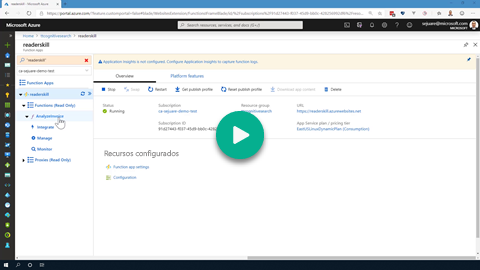
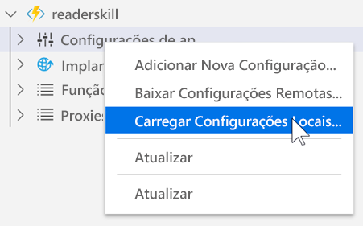
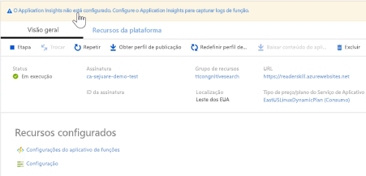

## <a name="demo-3---creating-a-custom-invoice-reader-skill"></a>Demonstração 3 – Criar uma habilidade personalizada de Leitor de Faturas

[](https://globaleventcdn.blob.core.windows.net/assets/aiml/aiml10/videos/Demo2.mp4 "Demonstração 3")

## <a name="summary"></a>Resumo
Neste exercício, criamos uma habilidade do Azure Search (na forma de uma função do Azure) que coleta dados do Azure Search e retorna um documento json estruturado que representa o conteúdo da fatura em PDF. Para obter uma análise mais aprofundada sobre a criação de uma função do Azure, confira a [documentação](https://docs.microsoft.com/en-us/azure/azure-functions/functions-create-first-azure-function-azure-cli?WT.mc_id=msignitethetour2019-github-aiml10). Supõe-se que foi criada uma conta de armazenamento (como descrito no [primeira demonstração](demo1.md), bem como o serviço de Reconhecimento de Formulários criado na [segunda demonstração](demo2.md))


## <a name="what-you-need"></a>Do que você precisa
- [Conjunto de teste de faturas](https://globaleventcdn.blob.core.windows.net/assets/aiml/aiml10/data/train.zip) (usado para testar a função do Azure)


- O [Postman](https://www.getpostman.com/) é usado para enviar solicitações para a API REST do serviço Reconhecimento de Formulários. Confira este [manual rápido](postman.md) para saber mais.

- [Coleção](src/Collections/Reader_Skill.postman_collection.json) de Solicitações de Habilidades de Leitura do Postman.

- [Azure Functions Core Tools](https://docs.microsoft.com/en-us/azure/azure-functions/functions-run-local?WT.mc_id=msignitethetour2019-github-aiml10#v2)

## <a name="azure-resources"></a>Recursos do Azure
A tabela a seguir descreve os recursos criados neste exercício.

| Nome                       | Tipo                            | Finalidade                    |
| -------------------------- | ------------------------------- | ------------------------- |
| **readerskillstorage**   | Conta de armazenamento              | Armazenamento usado na função do Azure |
| **readerskill**          | Aplicativo de Funções                 | Aplicativo de habilidades cognitivas |
| **readerskill**          | App Insights                   | Adiciona informações ao aplicativo de funções |
| **EastUS2LinuxDynamicPlan** | Plano do Serviço de Aplicativo                   | Plano baseado em consumo para executar aplicativos de funções (que é criado implicitamente) |

## <a name="what-to-do"></a>O que fazer

Existem três etapas principais:
1. Executar localmente a função `InvoiceReaderSkill` do Azure
2. Criar recursos para dar suporte à função `InvoiceReaderSkill` do Azure
3. Executar `InvoiceReaderSkill` no Azure

### <a name="run-the-azure-function-locally"></a>Executar localmente a função do Azure

1. Baixe o código do [InvoiceReaderSkill](src/InvoiceReaderSkill) encontrado neste repositório em [Visual Studio Code](https://code.visualstudio.com/) (verifique se as [ferramentas](https://marketplace.visualstudio.com/items?itemName=ms-vscode.vscode-node-azure-pack) do Azure estão instaladas).

2. Adicione o arquivo `local.settings.json` à pasta com o seguinte conteúdo:

```json
{
  "IsEncrypted": false,
  "Values": {
    "FUNCTIONS_WORKER_RUNTIME": "python",
    "AzureWebJobsStorage": "{AzureWebJobsStorage}",
    "FormsRecognizerEndpoint": "<YOUR_FORMS_ENDPOINT>.cognitiveservices.azure.com",
    "FormsRecognizerKey": "<YOUR_FORMS_KEY>",
    "ModelId": "<YOUR_TRAINED_MODEL_ID>"
  }
}
```
3. Execute o comando `func host start` para iniciar a função.

4. Importe a [coleção](src/Collections/Reader_Skill.postman_collection.json) de Solicitações de Habilidades de Leitura do Postman

5. Abra a Solicitação `Local Forms Skills` e altere o script de pré-solicitação para definir a variável `storageAccount` para a sua conta de armazenamento (no vídeo, a variável é `ttinvoicestorage`) e o `SASValue` para a Assinatura de Acesso Seguro apropriada para o contêiner `train`. Para saber como obter uma Assinatura de Acesso Seguro, confira nossa [breve explicação](sas.md).

```javascript
pm.environment.set('storageAccount', '<YOUR STORAGE ACCOUNT>')
pm.environment.set('container', 'test')
pm.environment.set('SASValue', '<SAS>')
```

6. Verifique se o URI `POST` corresponde ao URI da função do Azure (em nossa execução, usamos `http://localhost:7071/api/AnalyzeInvoice`) e clique em Enviar. Você deve receber uma resposta semelhante a esta:


### <a name="create-azure-function-resources"></a>Criar Recursos para o Azure Functions

Supõe-se que os comandos a seguir sejam executados no mesmo diretório que a função real

1. Execute os seguintes comandos de CLI do Azure para criar os recursos apropriados e publicar a função:

Criar Armazenamento de Função

```
az storage account create --name {FUNCTION_STORAGE} --location {LOCATION} --resource-group {YOUR_RG} --sku Standard_LRS
```

Criar Aplicativo de Função
```
az functionapp create --resource-group {YOUR_RG} --consumption-plan-location {LOCATION} --name {FUNCTION_NAME} --storage-account {FUNCTION_STORAGE} --runtime python --os-type linux
```
Publicar Função
```
func azure functionapp publish {FUNCTION_NAME} --build remote
```

2. Use Visual Studio Code para sincronizar as configurações locais para a função do Azure: selecione o botão Azure, navegue até a função recém-criada, clique com o botão direito do mouse em `Application Settings` e selecione `Upload Local Settings` (observação: não substitua as variáveis existentes).



3. Navegue até o Aplicativo de Funções recém-criado no portal para adicionar o Application Insights ao serviço.



### <a name="run-the-azure-function-in-the-cloud"></a>Executar a Função do Azure localmente

1. Abra a Solicitação `Cloud Forms Skills` e altere o script de pré-solicitação para definir a variável `storageAccount` para a sua conta de armazenamento (no vídeo, a variável é `ttinvoicestorage`) e o `SASValue` para a Assinatura de Acesso Seguro apropriada para o contêiner `train`. Para saber como obter uma Assinatura de Acesso Seguro, confira nossa [breve explicação](sas.md).

```javascript
pm.environment.set('storageAccount', '<YOUR STORAGE ACCOUNT>')
pm.environment.set('container', 'test')
pm.environment.set('SASValue', '<SAS>')
```

2. Verifique se o URI `POST` corresponde ao URI da função do Azure (deve se parecer com `https://<YOUR_ENDPOINT>.azurewebsites.net/api/AnalyzeInvoice`) e clique em Enviar. Você deve receber uma resposta semelhante a esta:


# <a name="next-demo"></a>Próxima demonstração
Saiba como unir tudo para finalmente criar a solução de ponta a ponta ao continuar na [Demonstração 4 – Reunir tudo](demo4.md)