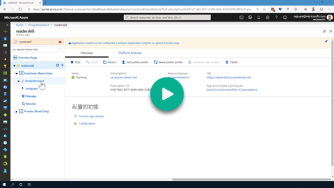
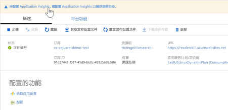

## <a name="demo-3---creating-a-custom-invoice-reader-skill"></a>演示 3 - 创建自定义发票读取者技能

[](https://globaleventcdn.blob.core.windows.net/assets/aiml/aiml10/videos/Demo2.mp4 "演示 3")

## <a name="summary"></a>摘要
在此练习中，我们创建一项 Azure 搜索技能（采用 Azure 函数的形式）。该技能从 Azure 搜索获取数据，返回描述 pdf 发票内容的结构化 json 文档。 若要更深入地了解如何创建 Azure 函数，请参阅[文档](https://docs.microsoft.com/en-us/azure/azure-functions/functions-create-first-azure-function-azure-cli?WT.mc_id=msignitethetour2019-github-aiml10)。假定已创建存储帐户（如[第一个演示](demo1.md)中所述）并已创建表单识别器服务（如[第二个演示](demo2.md)中所述）


## <a name="what-you-need"></a>需要什么
- [发票测试集](https://globaleventcdn.blob.core.windows.net/assets/aiml/aiml10/data/train.zip)（用于测试 Azure 函数）


- [Postman](https://www.getpostman.com/) 用于将请求发送到表单识别器服务 REST API。 请参阅此[简要入门](postman.md)以了解详细信息。

- Postman 读取者技能请求[集合](src/Collections/Reader_Skill.postman_collection.json)。

- [Azure Functions Core Tools](https://docs.microsoft.com/en-us/azure/azure-functions/functions-run-local?WT.mc_id=msignitethetour2019-github-aiml10#v2)

## <a name="azure-resources"></a>Azure 资源
下表说明了在此练习中创建的资源。

| 名称                       | 类型                            | 用途                    |
| -------------------------- | ------------------------------- | ------------------------- |
| **readerskillstorage**   | 存储帐户              | 用于 Azure 函数的存储 |
| **readerskill**          | 函数应用                 | 认知技能应用 |
| **readerskill**          | App Insights                   | 向函数应用添加见解 |
| **EastUS2LinuxDynamicPlan** | 应用服务计划                   | 基于消耗情况的计划，用于运行函数应用（这是隐式创建的） |

## <a name="what-to-do"></a>要执行的操作

有三个主要步骤：
1. 在本地运行 `InvoiceReaderSkill` Azure 函数
2. 创建用于支持 `InvoiceReaderSkill` Azure 函数的资源
3. 在 Azure 上运行 `InvoiceReaderSkill`

### <a name="run-the-azure-function-locally"></a>在本地运行 Azure 函数

1. 下载 [Visual Studio Code](https://code.visualstudio.com/) 的此存储库中的 [InvoiceReaderSkill](src/InvoiceReaderSkill) 代码（务必安装 [Azure Tools](https://marketplace.visualstudio.com/items?itemName=ms-vscode.vscode-node-azure-pack)）。

2. 将 `local.settings.json` 文件添加到包含以下内容的文件夹：

```json
{
  "IsEncrypted": false,
  "Values": {
    "FUNCTIONS_WORKER_RUNTIME": "python",
    "AzureWebJobsStorage": "{AzureWebJobsStorage}",
    "FormsRecognizerEndpoint": "<YOUR_FORMS_ENDPOINT>.cognitiveservices.azure.com",
    "FormsRecognizerKey": "<YOUR_FORMS_KEY>",
    "ModelId": "<YOUR_TRAINED_MODEL_ID>"
  }
}
```
3. 运行 `func host start` 命令以启动函数。

4. 将 Postman 读取者技能请求[集合](src/Collections/Reader_Skill.postman_collection.json)导入到 Postman

5. 打开 `Local Forms Skills` 请求并更改预请求脚本，将 `storageAccount` 变量设置为你的存储帐户（在视频中，此变量为 `ttinvoicestorage`），并将 `SASValue` 设置为 `train` 容器的相应安全访问签名。 若要了解如何获取安全访问签名，请参阅我们的[简要说明](sas.md)。

```javascript
pm.environment.set('storageAccount', '<YOUR STORAGE ACCOUNT>')
pm.environment.set('container', 'test')
pm.environment.set('SASValue', '<SAS>')
```

6. 验证 `POST` URI 是否与 Azure 函数的 URI（在运行它时，我们使用 `http://localhost:7071/api/AnalyzeInvoice`）匹配，然后单击“发送”。 应该会获得如下所示的响应：


### <a name="create-azure-function-resources"></a>创建 Azure 函数资源

假定以下命令在实际函数所在的目录中运行

1. 运行以下 Azure CLI 命令，以便创建相应的资源并发布函数：

创建函数存储

```
az storage account create --name {FUNCTION_STORAGE} --location {LOCATION} --resource-group {YOUR_RG} --sku Standard_LRS
```

创建函数应用
```
az functionapp create --resource-group {YOUR_RG} --consumption-plan-location {LOCATION} --name {FUNCTION_NAME} --storage-account {FUNCTION_STORAGE} --runtime python --os-type linux
```
发布函数
```
func azure functionapp publish {FUNCTION_NAME} --build remote
```

2. 使用 Visual Studio Code 将本地设置同步到 Azure 函数，方法是：选择“Azure”按钮，导航到新创建的函数，右键单击`Application Settings`，然后选择`Upload Local Settings`（注意：请勿覆盖现有的变量）。


3. 在门户中导航到新创建的函数应用，将 Application Insights 添加到服务。



### <a name="run-the-azure-function-in-the-cloud"></a>在云中运行 Azure 函数

1. 打开 `Cloud Forms Skills` 请求并更改预请求脚本，将 `storageAccount` 变量设置为你的存储帐户（在视频中，此变量为 `ttinvoicestorage`），并将 `SASValue` 设置为 `train` 容器的相应安全访问签名。 若要了解如何获取安全访问签名，请参阅我们的[简要说明](sas.md)。

```javascript
pm.environment.set('storageAccount', '<YOUR STORAGE ACCOUNT>')
pm.environment.set('container', 'test')
pm.environment.set('SASValue', '<SAS>')
```

2. 验证 `POST` URI 是否与 Azure 函数的 URI（看起来应该类似于 `https://<YOUR_ENDPOINT>.azurewebsites.net/api/AnalyzeInvoice`）匹配，然后单击“发送”。 应该会获得如下所示的响应：


# <a name="next-demo"></a>下一演示
请转到[演示 4 - 将所有内容整合在一起](demo4.md)，了解如何将所有内容整合在一起，最终生成端到端解决方案