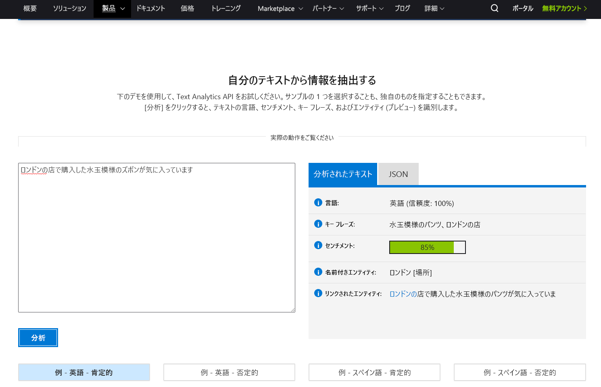

# <a name="aiml40---taking-models-to-the-next-level-with-azure-machine-learning-best-practices"></a>AIML40 - Azure Machine Learning のベスト プラクティスでモデルを次のレベルに進める

## <a name="session-information"></a>セッション情報

人工知能と機械学習をさまざまな方法で使用して、データの非構造化フロー内のイメージ、テキスト、および傾向を分析することで、ビジネス プロセスの生産性を向上させ、有意な分析情報を収集することができます。 既存のモデルを使用して多くのタスクを解決できますが、場合によっては、特定のタスクのために、または精度を高めるために、独自のモデルをトレーニングすることも必要になります。 

このセッションでは、テキスト分析インテリジェント サービスを [Tailwind Traders](http://tailwindtraders.com) のビジネス プロセスに統合する完全なプロセスについて説明します。これには、[コグニティブ サービス](https://azure.microsoft.com/services/cognitive-services/?WT.mc_id=msignitethetour2019-github-aiml40)として使用できる事前構築モデルから、[Azure Machine Learning service](https://azure.microsoft.com/services/machine-learning-service/?wt.mc_id=msignitethetour2019-github-aiml40) を使用して、[Intel NLP Architect](http://nlp_architect.nervanasys.com/) の一部として使用できる[アスペクトベースの感情分析](https://www.intel.ai/introducing-aspect-based-sentiment-analysis-in-nlp-architect/)のサードパーティ ニューラル カスタム モデルをトレーニングするプロセスまで含まれます。 ここでは、カスタム モデルが必要なケースについて説明します。このようなモデルを [AutoML](https://docs.microsoft.com/azure/machine-learning/service/concept-automated-ml/?wt.mc_id=msignitethetour2019-github-aiml40) を使用してゼロから簡単に作成する方法をデモンストレーションし、[HyperDrive](https://docs.microsoft.com/azure/machine-learning/service/how-to-tune-hyperparameters/?wt.mc_id=msignitethetour2019-github-aiml40) を使用してモデルのハイパー パラメーターを微調整する方法を示します

## <a name="delivery-assets"></a>プレゼンテーション用アセット

* [PowerPoint デッキ](https://globaleventcdn.blob.core.windows.net/assets/aiml/aiml40/AIML40_Taking_Models_to_the_Next_Level_with_Azure_Machine_Learning_Best_Practices.pptx)
* デモンストレーション ビデオ:
    * デモ 1 - [Cognitive Services Text Analytics](https://youtu.be/QJxjm5BirOA)
    * デモ 2 - [自動機械学習](https://youtu.be/qrstXN6TLZk)
    * デモ 3 - [Azure Machine Learning SDK と Hyperdrive](https://youtu.be/sccNTPO3PwU)
* [その他のプレゼンター リソース](README-Instructor.md)

## <a name="overview-of-demonstrations"></a>デモの概要

このプレゼンテーションでは、次のデモを行います。

1. [Cognitive Services Text Analytics](https://azure.microsoft.com/services/cognitive-services/text-analytics/?wt.mc_id=msignitethetour2019-github-aiml40) を使用して衣料レビューの感情を確認します
2. [Azure 自動 ML](https://docs.microsoft.com/azure/machine-learning/service/concept-automated-ml/?wt.mc_id=msignitethetour2019-github-aiml40) を使用して、コードをほぼ使用せずにテキスト分類子を作成します
3. [Azure Machine Learning service](https://azure.microsoft.com/services/machine-learning-service/?wt.mc_id=msignitethetour2019-github-aiml40) を使用してアスペクトベースの感情分析モデルをトレーニングします。

## <a name="starting-fast"></a>すばやく開始

すぐに開始する場合は、Azure テンプレートを使用して必要なすべてのリソースをデプロイし、Azure Notebooks でコードを開くことができます。 

<a href="https://portal.azure.com/#create/Microsoft.Template/uri/https%3A%2F%2Fraw.githubusercontent.com%2Fmicrosoft%2Fignite-learning-paths-training-aiml%2Fmaster%2Faiml40%2Ftemplate%2Fazuredeploy.json" target="_blank">
 
</a>
<!-- TODO: provide correct Azure Notebook path -->
<a href="https://notebooks.azure.com/sosh/projects/ignite-absa"></a>

以下に、デモの詳細な手順を示します。これにより、手順を手動で実行して、示されている概念を完全に理解できます。

## <a name="initial-environment-setup"></a>環境の初期セットアップ

デモの手順 2 と 3 を実行するには、次の操作を実行する必要があります。

1. Azure Machine Learning ワークスペースを作成する
2. AutoML トレーニングに使用するデータをアップロードする - [clothing_automl.xlsx](dataset\clothing_automl.xlsx)


#### <a name="creating-azure-machine-learning-workspace"></a>Azure Machine Learning ワークスペースを作成する

Azure ML ワークスペースは、次のいずれかの方法で作成できます。
* [Azure portal](http://portal.azure.com/?wt.mc_id=msignitethetour2019-github-aiml40) から手動で作成する ([完全なチュートリアルについてはこちらをご覧ください](https://docs.microsoft.com/azure/machine-learning/service/how-to-manage-workspace/?wt.mc_id=msignitethetour2019-github-aiml40))
* 提供された Azure テンプレートからデプロイする
* [Azure CLI](https://docs.microsoft.com/ru-ru/cli/azure/?view=azure-cli-latest&wt.mc_id=msignitethetour2019-github-aiml40) を使用して作成する

> "*注: (この例では `absa` を名前として使用し、*米国西部 2* データセンターを使用していますが、自由に変更できます)* "

```shell
az extension add -n azure-cli-ml
az group create -n absa -l westus2
az ml workspace create -w absa_space -g absa
```

また、サブスクリプション ID も把握しておく必要があります。これは `az account list` を実行することで取得できます。

#### <a name="uploading-data-to-the-workspace"></a>ワークスペースにデータをアップロードする

このデモでは、次のいくつかのデータセットを使用します。
* 自動 ML デモのデータセット - [clothing_automl.xlsx](dataset/clothing_automl.xlsx)
* デモ 3 のアスペクト ベースの感情分析モデル全体をトレーニングするための大規模なデータセット [clothing_absa_train.csv](dataset/clothing_absa_train.csv)
* アスペクト ベースの感情分析モデルに使用する小規模なデバッグ データセット [clothing_absa_train_small.csv](dataset/clothing_absa_train_small.csv)
* モデルをテストするための別個の検証セット [clothing-absa-validation.json](dataset/clothing-absa-validation.json)

自動 ML デモをフォローするには、データセットをワークスペースにアップロードしてください。 これを行うには、[Azure ML ポータル](http://ml.azure.com/?wt.mc_id=msignitethetour2019-github-aiml40)を使用して手動で実行するか、または指定されたファイル `upload_dataset.py` を使用します (csv/xlsx ファイルは現在のディレクトリに存在する必要があり、サブスクリプションに従って `[subscription_id]` を置き換える必要があります)。

```shell
python upload_dataset.py -s [subscription_id] -w absa_space -g absa -f clothing_automl.xlsx
```

自動 ML の clothing データセットは、デモ コードによって AML サービス データストアにアップロードされます。

#### <a name="using-the-azure-ml-demo-code"></a>Azure ML デモ コードを使用する

デモ コードは、任意の Jupyter Notebook 環境から実行できます。 次のことが行えます。
 - 「**Python 環境のインストール**」の説明に従って、Python 環境をローカルにインストールします
 - [Azure Notebooks](https://docs.microsoft.com/azure/notebooks/azure-notebooks-overview/?wt.mc_id=absa-notebook-abornst) を使用します。 この場合、`absa.ipynb` ファイルを新しい Azure Notebooks プロジェクトにアップロードするか、または単に [notebook ライブラリ](https://notebooks.azure.com/sosh/projects/ignite-absa)を複製します。
 <!-- TODO: provide final path to notebook library -->

#### <a name="python-environment-installation"></a>Python 環境のインストール

Azure Notebooks を使用せず、ローカルの Python 環境を使用する場合は、Python Azure ML SDK をインストールし、notebook と contrib をインストールする必要があります。

```shell
conda create -n azureml -y Python=3.6
source activate azureml
pip install --upgrade azureml-sdk[notebooks,contrib] 
conda install ipywidgets
jupyter nbextension install --py --user azureml.widgets
jupyter nbextension enable azureml.widgets --user --py
```

この後、Jupyter を再起動する必要があります。 詳細な手順については、[こちら](https://docs.microsoft.com/azure/machine-learning/service/quickstart-create-workspace-with-python/?WT.mc_id=msignitethetour2019-github-aiml40)をご覧ください

開始するために無料試用版アカウントが必要な場合は、[こちら](https://azure.microsoft.com/offers/ms-azr-0044p/?WT.mc_id=msignitethetour2019-github-aiml40)で取得できます

#### <a name="pre-creating-compute-cluster"></a>コンピューティング クラスターを事前作成する

最後の 2 つのデモでは、コンピューティング クラスターが必要になります。 デモを目的として、1 つのノードのみで構成されるクラスターを作成します。 これは、次の 3 つの方法のいずれかで実行できます。

1. [Azure ML ポータル](http://ml.azure.com/?wt.mc_id=msignitethetour2019-github-aiml40)で **[コンピューティング]** セクションに移動し、ノード番号 1 を指定して、"*Standard_DS3_v2*" VM を使用して Azure ML コンピューティング クラスターを手動で作成します。 クラスターに `absa-cluster` という名前を付けます。
2. 上記のパラメーターを指定して、指定された `create_cluster.py` スクリプトを実行します。
```shell
python create_cluster.py -s [subscription_id] -w absa_space -g absa
```
3. `absa.ipynb` ノートブックの最初のいくつかのセルを実行すると、クラスターが作成されます。

## <a name="demos"></a>デモ

### <a name="demo-1-text-analytics-cognitive-service"></a>デモ 1:Text Analytics コグニティブ サービス

このデモでは、Text Analytics を使用して Web インターフェイスで語句の感情分析をどのように実行できるかについて説明します。

1. [Text Analytics ページ](https://azure.microsoft.com/services/cognitive-services/text-analytics/?WT.mc_id=msignitethetour2019-github-aiml40)を開きます
2. 下にスクロールして **[動作中に確認]** セクションに移動し、「*ロンドンの店で購入した水玉模様のズボンが気に入っています*」という語句を入力します (既定の語句をそのまま使用することもできます)。
3. **[分析]** を押すと、次の結果が得られます。



Text Analytics では感情が得られるだけでなく、テキストから場所とキー ワードも抽出されることに注意してください。

### <a name="demo-2-azure-automl"></a>デモ 2:Azure AutoML

このデモでは、自動 ML を使用してコーディングなしで ML モデルを構築する方法について説明します。

1. [http://ml.azure.com](http://ml.azure.com/?WT.mc_id=msignitethetour2019-github-aiml40) で、(上記で作成した) Azure ML ワークスペースに移動します
2. **[データセット]** に移動すると、前にアップロードしたデータセット (clothing_automl.xlsx) が表示されます。 ポータルからここにアップロードすることもできます。
3. データセットを選択します。
4. 必要に応じて、 **[概要]** タブで **[Sample usage]/(使用例/)** を展開し、プログラムでデータにアクセスするために使用できるコードを表示します。
5. **[Explore]/(探索/)** タブで、データを確認します。
6. **[自動 ML]** タブに移動し、 **[新しい実験]** をクリックします
7. 使用する実験名とコンピューティングを選択します。
8. データセットを選択します。
9. 予測タスクの種類を選択します -- **[分類]** 。
10. ターゲット列を選択します -- **[評価]** 。
11. **[開始]** をクリックします。

さまざまなアルゴリズムが調査されるため、実験の実行にはかなりの時間がかかります。 デモを示す場合は、これを事前に実行しておき、結果だけ表示することをお勧めします。

### <a name="demo-3-using-azure-ml-workspace-with-python-sdk"></a>デモ 3:Python SDK で Azure ML ワークスペースを使用する

このデモでは、Python Azure ML SDK を使用するカスタム Python コードを実行して、カスタムのアスペクト ベースの感情分析 (ABSA) モデルをトレーニング、最適化、および使用します。

デモのこの部分のすべての手順は、Jupyter Notebook 自体に含まれています。 上記で説明したいずれかの方法を使用して Notebook を (Azure Notebooks またはローカルで) 実行し、その手順に従います。 

## <a name="tear-down"></a>破棄

デモ中に使用したクラウド リソースを解放するには、Azure ML ワークスペースとリソース グループを削除する必要があります。

```shell
az ml workspace delete --w absa_space -g absa
az group delete -n absa
```

## <a name="presenter-resources"></a>プレゼンター リソース

このコンテンツをプレゼンテーションする場合は、[その他のプレゼンター リソース](README-Instructor.md)をご覧ください。

## <a name="resources-and-continue-learning"></a>リソースと継続学習

### <a name="getting-started-series"></a>入門シリーズ

* [Azure Cognitive Services Text Analytics API](https://aka.ms/TextCogSvc)
* [自動機械学習](https://aka.ms/AutomatedMLDoc)
* [ハイパーパラメーターの調整](https://aka.ms/AzureMLHyperDrive)
* [Azure ML サービスと Python SDK](https://aka.ms/AA3dzht) 

### <a name="other-materials"></a>その他の資料

* [運用環境で機械学習を使用する 9 つの高度なヒント](aka.ms/9TipsProdML)
* [Intel のアスペクトベースの感情分析ページ](https://www.intel.ai/introducing-aspect-based-sentiment-analysis-in-nlp-architect/)
* Azure ML ベスト プラクティス リポジトリ:
    * [自然言語処理](https://github.com/microsoft/nlp/)
    * [Computer Vision](https://github.com/microsoft/ComputerVision)
    * [推薦者](https://github.com/microsoft/Recommenders)


## <a name="feedback-loop"></a>フィードバック ループ

コメント、フィードバック、ご提案はございますか。 現在のところ、コンテンツへの変更、提案、またはフィードバックをお送りいただく場合、最良のフィードバック ループとしてこの GitHub リポジトリで新しいイシューを作成していただくことをお勧めします。 イシューの作成方法については、[共同作成](../../contributing.md)に関するドキュメントをご覧ください
